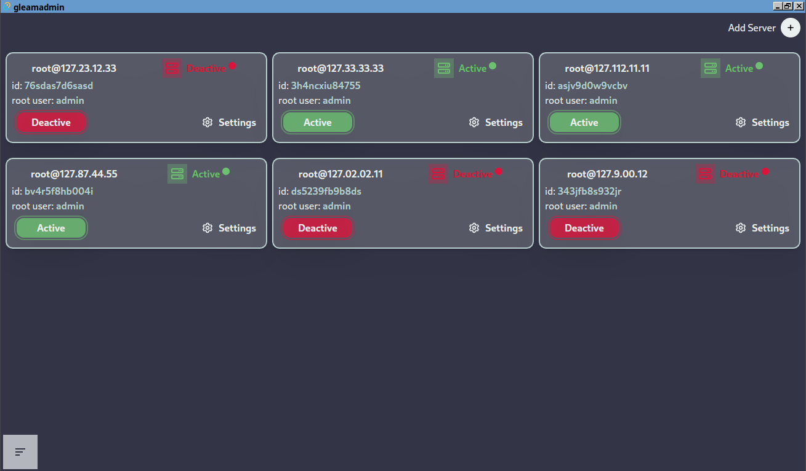

## Authors

- [@Inal Karakhanli](https://www.github.com/nickforhuman)

# gleamadmin

GleamAdmin is a modern desktop application built with Tauri and Vue.js, designed to simplify secure remote server management. With an intuitive interface, it allows users to connect to remote servers using IP and root credentials, execute essential system commands, and monitor server status in real-time. By leveraging secure SSH connections, GleamAdmin makes server control accessible and safe for users of all levels.

## screenshot

## Demo

# comming soon release
